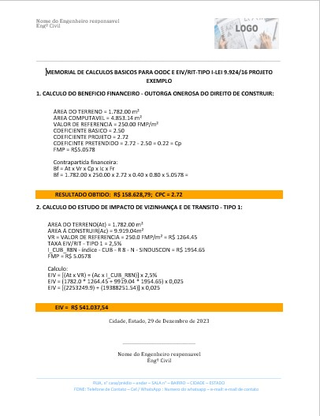

Script criado em Python afim de calcular e gerar um documento de Memorial de Calculos Basicos para OODC e EIV/RIT-TIPO I-Lei 9.924/16
BF = Beneficio Financeiro
EIV = Estudo de Impacto de Vizinhança      

PROGRAMA SENDO EXECUTADO passo a passo:

1-

        Qual o nome do projeto
        DIGITE (apenas um para ser o titulo): 
        exemplo de preenchimento: rua javri 
Inserção do usuario:
        
        EXEMPLO
2-

        Insira a AREA DO TERRENO em m²:
Resposta do usuario:

        1782
3-      

        Insira a AREA COMPUTÁVEL em m²:
Resposta do usuario:
        
        4853.14
4-

        Insira o VALOR REFERENCIA: 
Resposta do usuario:

        250
5-

        Insira qual a zona desejada
        Zona de Qualificação (1)
        Zona de Reestruturação (2)
Resposta do usuario:

        1
6-

        Para REFAZER o calculo insira "R"
        Para CONFIRMAR o calculo digite "C"
Resposta do usuario:

        c
7-

        Insira a Área a Construir:
Resposta do usuario:

        9919.04
8-

        Deseja alterar o indice ou manter o de JUNHO DE 2023 (R$1.954,65)?
        Insira "M" para manter;
        Para alterar, insira o novo valor:
Resposta do usuario:

        m
9-

        Para REFAZER o calculo insira "R"
        Para CONFIRMAR o calculo digite "C"
Resposta do usuario:

        c
10-

        Arquivo 'EXEMPLO-BF_EIV-29-12-23/18:06:21.docx' foi criado com sucesso!
        Digite:
        E -> Encerrar
        C -> Criar outro documento
Resposta do usuario:

        e

Resultado Final:

